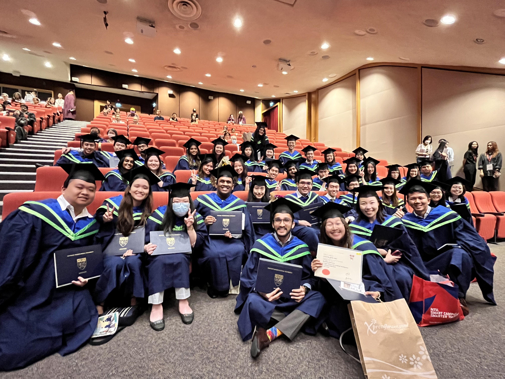

And off into the world we go!

<!-- truncate -->

As Captain DSAI, I feel obliged to make the following pseudo-Valedictorian speech so here goes.

25 July 2023 marked the graduation of our second batch of graduates, and boy does it feel great to finally hold the certificate in your hands.
All the long nights spent chasing deadlines or squashing pesky bugs have never felt more satisfying.
It has already been 4 years but it definitely doesn't feel that long (cliche, I know).

## A Rocky Road

We have weathered thick and thin to finally be here on stage.
Despite the challenges that we faced like studying through a pandemic or having important university experiences like exchange cancelled, we have all pushed through and finally made it out the other side.
Some of us were fortunate enough to be able to still go for exchange during the Summer/Winter breaks unlike some like myself that had shackled ourselves to the Work Study programme that left us little manouverability.

Even after finishing this arduous degree in a top university with the skillsets that are necesary for at least the next decade, we enter an uncertain job market where entry level software roles require 3 years of experience and AI roles require a Master's degree.
Some of us have had our offers rescinded even before we start work leaving us with short deadlines and even more uncertain futures.

## The Fighting Spirit

As the guest speaker during the ceremony rightly said, "take responsibilty of your own life and have a never say die attitude".
We as young tech talent with a determined mind and a bag full of aspiration have already embodied some of the spirit of his message in our short time here.
It is my personal hope that we can indeed achieve something great in the years to come.
Maybe one of us will be invited back to give this same talk to the 20th batch of DSAI graduates.
Only time will tell.

## A HUGE Thank You

On behalf of all the graduates, I would like to extend a thank you to the family, friends and special ones that have been with us through thick and thin and encouraged us to do our best.
Celebrating our wins and being by our side when things don't go exactly as planned.
We thank you for enduring our extended absences from home as we stay on campus to make lifelong friends and becoome an integral member of society.
We appreciate your hard work and sacrifice for giving us the opportunity to excel.
We are grateful that you have made time in your day to sit through a long ceremony to show your ever-lasting support for us.
And finally, we hope that we have made you proud by finally walking on the stage to conclude your laborious 16 years of educating us.

## A Parting Word

Perhaps in a year or 2 we would have all moved on and become so busy with our lives with all the work, family, and personal commitments that we lose sight of all the times that we have had together.
In some ways I have made some efforts to keep the bond intact with this site (if anyone chooses to contribute going forward) as well as [LinkedIn](https://www.linkedin.com/groups/14179006/) and WhatsApp groups so that we can all still keep in touch personally with batches both young and old and draw inspiration from one another.
But someday when we all come back together for a dinner, I hope that we remember these times and see how far we have come.
I hope the memories all come rushing back and fill us with joy.
I hope the friendships last our whole lifetimes.

Wishing you all the best.

Grad Lo!
