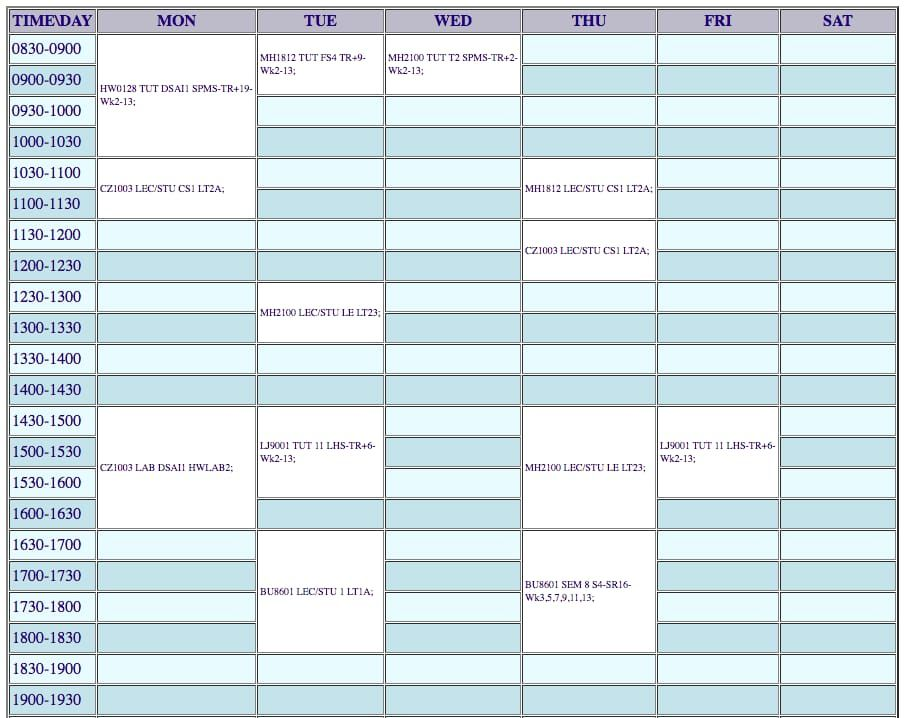

### Where can I find all the important information about matriculation?

You can refer to the Freshman Guide [here](https://www.ntu.edu.sg/admissions/undergraduate/freshmen/freshmen-guide). Do take note of the important dates listed [here](https://www.ntu.edu.sg/admissions/undergraduate/freshmen/important-dates).

### For the first semester, will our timetables be preallocated to us?

Timetables will be preallocated to you. You can check your timetable after you matriculate online. The list of class schedules has been published [here](https://wish.wis.ntu.edu.sg/webexe/owa/aus_schedule.main) (but you won't know which one you are in until you matriculate online). Once class starts, you can change your class timings during Add/Drop Period (week 1 - 2). Then you can change your timetable according to how you want to spend your week. As a personal recommendation, get to know your DSAI coursemates as these will be the people you will stick with for 4 years of your time in NTU.

### How should we apply for exemptions for particular modules?

You will usually be contacted by the school administrator if you are eligible for exemptions. Usually there is an academic briefing session at the start of the semester with the Associate Chair (Academic), so the details will be clearly communicated during the session.

### Will they teach us how to register for courses?

You can refer to our very own [STARS Guide](../../User-Guides/STARS.md) or check out the [official document](https://www.ntu.edu.sg/admissions/undergraduate/freshmen/course-registration) once you have created your network account.

### Is the timetable usually very packed?

You can expect to have 1-3 classes everyday, which can be lab / lecture / tutorial. If you plan your timetable well, you may even have a free day. If you register for 18 AUs, you can expect roughly 18 contact hours every week. (But psst, most lectures are recorded, so it is ok not to be physically present) Below is a sample for your reference.

